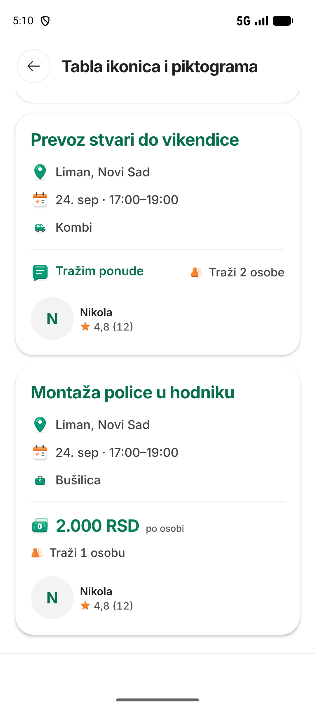
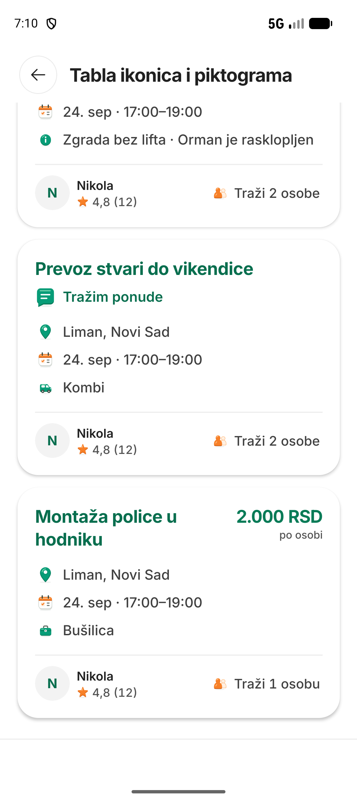

# R16 native evidence index

The source is `b4ba8a8d92c066d23b357c690cfdb42041a2c062`. Both target APKs were verified before update installation.

- [Physical phone review](NATIVE_REVIEW.phone.md): owner's VKP-NX9 / Android 16, existing ~361 dp / font 1.15.
  Fourteen captured states, with pixel and accessibility-only review distinguished in the manifest.
- [Emulator review](NATIVE_REVIEW.emulator.md): 411 dp / font 1.0, plus one bounded 320 dp / font 1.3 state.
  Sixteen captured states; density and font restored. Local date apply/reset and search dismissal were exercised.
- [Checks](CHECKS.json) and [receipt](RECEIPT.json) separate source verification, installation, device scope and
  the unsuccessful remote control-table import. Local generation succeeded; remote publication is unconfirmed.

## Same-fixture comparison, ordinary size

These are **inert gallery fixtures**, not real task/account data. Both are native Android captures at density 420,
font 1.0. The offers and per-person cards are fully visible; the top card is clipped and excluded from measurement.

| Before R15 | After R16 |
| --- | --- |
|  |  |

Offers: 827 to 712 pixels. Per-person: 918 to 697 pixels. Facts and compensation meaning remain; no fixed height
is introduced. Phone layout refinements, actual photograph rendering, whole journeys, iOS, R14-N01, owner visual
acceptance and release gates remain open. Read [next batch](NEXT_BATCH.md) before continuing.
