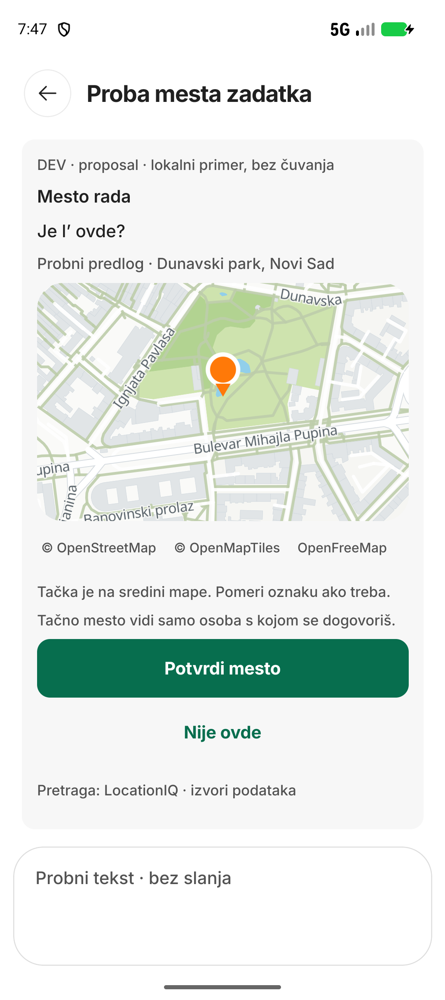

# Native screenshot evidence

Updated 2026-09-28. This index points to actual committed device captures. It is not a design proposal gallery or a second acceptance tracker. Follow the [current plan](../PLAN.md) and [generated matrix](../../../control/FINALIZATION_MATRIX.md) for remaining work.

## Current checkpoint: AI location composition

Emulator-5556, `rs.uskoci.dev`, source `10739a44`, APK [run 36353185115](https://github.com/Uskoci1/USKOCI-CLEAN/actions/runs/36353185115). Installed APK hash was rechecked and matches `4c476cffb61ee40f25aee99b0d522723aafd60ae2314541ed1aaa1174b528a4e`. See [capture metadata and image hashes](native-20260928-checkpoint/RECEIPT.json).

Route: `/dizajn-ai-mesto?scene=proposal`. This is a **local inert example at a public park**, not a real conversation or a new AI/geocoder response. No task/profile/location was saved; no private data or credentials appear. Basemap network requests still occur. The physical phone was not connected.

| Captured state | Evidence | What it proves |
| --- | --- | --- |
| Loading | [Unedited PNG](native-20260928-checkpoint/checkpoint-20260928-ai-place.png) | Loading presentation is visible at this checkpoint. |
| Map rendered | [Unedited PNG](native-20260928-checkpoint/checkpoint-20260928-ai-place-settled.png) | Map, marker, confirm/reject controls and composer rendered on this emulator. |

These two captures do **not** measure load duration, pin response time or animation quality. They do not prove drag, confirmation/save, live AI, route points, physical-phone behavior or FULL navigation return. The image is the current baseline, not a newly polished or finally approved layout. Visual follow-up: reduce supporting-copy/attribution bulk without hiding required attribution; preserve confirmation/recovery semantics and increase conversation space.

## Earlier native evidence, with its original scope

| Group | Images / receipt | Status and boundary |
| --- | --- | --- |
| Round30 | [Images](native-round30/) | Historical captures; inspect their dated receipts before using them as proof of a current behavior. |
| Round31 full list | [List](native-round31/r31-full-list.png), [return failure](native-round31/r31-full-return-settled.png), [receipt](ROUND_31_NATIVE_RECEIPT.json) | The navigation-return failure remains **OPEN**. A normal list still does not prove return recovery. |
| Round32 rejected attempt | [Candidate image](native-round32/r32-more-settled.png), [ANR diagnosis](ROUND_32_ANR_DIAGNOSIS.md) | **REJECTED** candidate `2b2cf4d7`; do not use as accepted UI or install its APK. |
| Round32 restored runtime | [Restored FULL](native-round32/r32-rollback-full.png), [recovered state](native-round32/r32-rollback-recovered.png), [receipt](ROUND_32_NATIVE_RECEIPT.json) | Limited restored-runtime check on `10739a44`. Original FULL-return defect is not closed. |

## Capture convention for subsequent implementation

1. Save original PNGs under a dated native evidence directory; include meaningful before/after and loading/empty/error states for the affected group.
2. Record source, route, scenario, device, timestamp, APK run and installed hash. Mark inert scenes separately from live flows.
3. Inspect for private content before committing. Prefer safe scenes; do not expose user messages or account details to make an illustration look realistic.
4. Link the evidence to the affected existing control rows. A screenshot alone never changes a row to READY.
5. For functional transitions, message delivery, motion and scale, retain the appropriate measured/reproducible proof alongside the stills.

Source push, native installation, DEV application and hosted dashboard publication are four separate facts. The hosted Claude table upload remains blocked by `invalid_argument` at this checkpoint.
