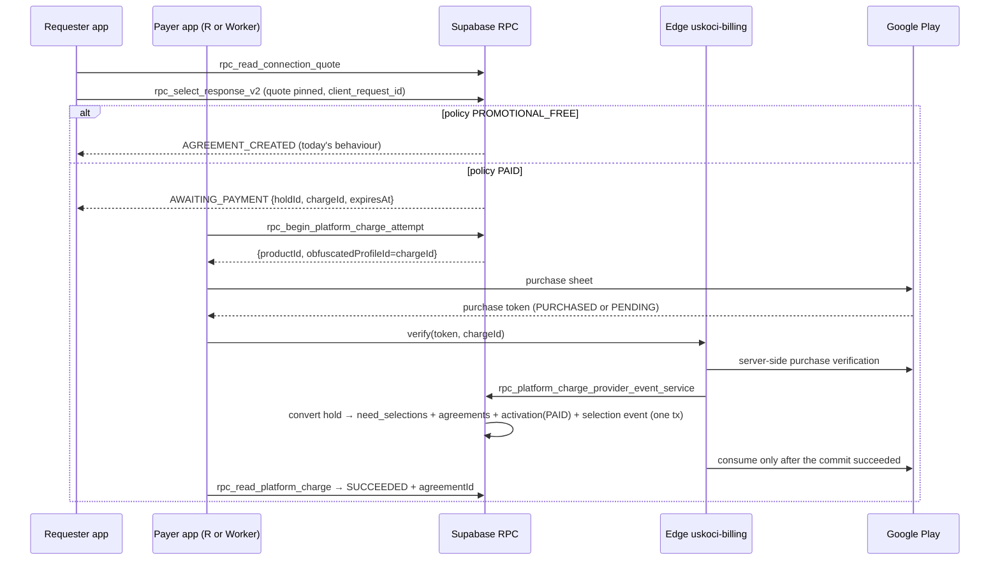
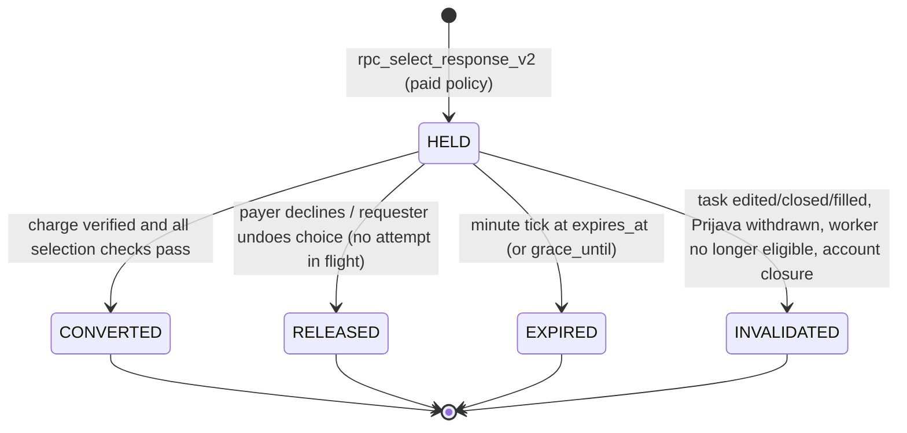
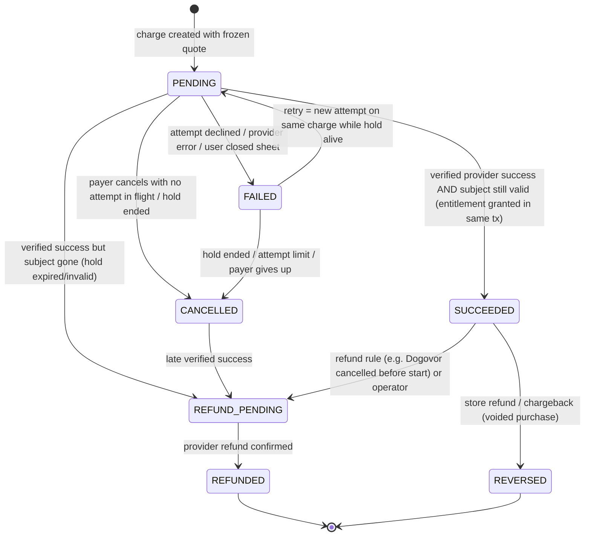

# USKOČI: payment-ready architecture and UX, design only

Date: 2026-09-23. Scope: this is research plus a design. No migration was written or applied. No dependency was added. No provider account was created and no real payment path was enabled. I only read the repository.

---

## Sažetak za vlasnika

Ovo je samo nacrt, i nijedno pravo plaćanje nije uključeno. U aplikaciji već postoji „Povezivanje“: beleži se pri svakom izboru prijave, sa cenom 0 RSD, i Dogovor ne može da nastane bez njega. Zato plaćanje treba da se uključi baš tu, a Zadatak, Prijava i Dogovor ostaju isti. Na Google Play-u u Srbiji sve što u aplikaciji nešto otključava (povezivanje, pretplata, HITNO) najverovatnije mora da ide preko Google Play naplate. Ona uzima 15%, a PDV plaćaš ti, jer je firma u Srbiji. Stripe ne radi u Srbiji. Domaći procesori (Monri, AllSecure, ChipCard, IPS QR) su za plaćanje preko sajta. Predlažem da izbor prvo sačuva mesto, a da se Dogovor otvori tek kada uplata prođe. Rok bi bio oko 15 minuta kada plaća onaj ko traži pomoć, a oko 60 minuta kada plaća onaj ko uskače. Ako uplata stigne kasno, novac se vraća sam. Cena posla i naknada aplikaciji uvek se prikazuju kao dve odvojene uplate, nikad kao zbir. Od tebe su potrebne ove odluke: ko plaća, koliko, preko koga, kada se novac vraća i kako se izdaje fiskalni račun. Pretplatu ne preporučujem za početak. Procenat vidim samo kao cenu povezivanja koja zavisi od vrednosti posla.

---

## 0. What exists today

These are facts read from the repository.

### 0.1 Povezivanje: a charge ledger that is locked to free

The file is `supabase/migrations/20260906100000_clean_p0d03_requester_connection_activation_v1.sql`. It is closed and live, see `docs/implementation/P0D03_REQUESTER_CONNECTION_ACTIVATION_V1_LIVE_CLOSURE.md`.

**`private.connection_policy_versions`**
- It holds one row, `REQUESTER_SELECTION_V1 / 1`.
- CHECK constraints hard-lock the policy:
  - `beneficiary_role = 'REQUESTER'`
  - `activation_reason = 'SELECTION'`
  - `charge_mode = 'PROMOTIONAL_FREE'`
  - `unit_basis = 'HEADCOUNT'`
  - `platform_cost_rsd = 0`

**`private.connection_activations`**
- It is immutable: the trigger `reject_connection_ledger_mutation` raises `CONNECTION_LEDGER_IMMUTABLE`.
- It enforces `state = 'SATISFIED'` and `platform_cost_rsd = 0`.
- Selection and Agreement are each unique.
- `units` = covered headcount.
- Both tables have RLS enabled and all access revoked.

**Deferred constraint trigger `agreements_require_connection_activation_trg`**
- Every new `public.agreements` row needs a matching free activation receipt before the transaction commits.
- This is the only point where a payment can attach without redesigning the Agreement.

**`public.rpc_select_response(uuid,integer,uuid,integer,text,text)`** does all of the following in one transaction:
- Idempotency: `private.selection_commands`, `request_hash`, `pg_advisory_xact_lock`.
- Checks: revision, response version, content hash, worker readiness, team capacity, eligibility and overfill.
- Writes, in order: `need_selections` (SELECTED), then `agreements` (CONFIRMED), then `agreement_versions` (the terms, including `price_rsd`), then `agreement_execution`, then `connection_activations` (free), then response SELECTED, then the need status.

Later candidates patch this function by anchor and pin its hash, and the policy block stays unchanged:
- `pkg029b` changes the remote/physical mode.
- `pkg033a` inserts `assert_application_price_v5` before the policy read.
- `pkg035a` pins the predecessor hash.

**Retention and closure.** `private.connection_activations` belongs to the `AGREEMENT_CORE` retention category:
- `20260908150000_clean_p3_retention_schedule_registry.sql`
- `20260912230039_clean_v5_policy_bound_closure.sql`

**There are no billing, entitlement, invoice or wallet tables.** A grep for billing/entitlement/payment/invoice/pricing in `supabase/migrations` and `supabase/candidates` finds only:
- the free ledger;
- `pricing_mode` (job price modes);
- the AI test budget, which is explicitly "not platform pricing".

The P0D-03 closure also states that paid/wallet/checkout relations are absent.

### 0.2 What a Dogovor unlocks

Nothing unlocks automatically. Each party shares its own data through grants.

- **Contact and exact location** (`20260830072818_clean_scoped_contact_reveal.sql`):
  - `access_grants` has two channels, `PHONE` and `EXACT_LOCATION`.
  - Only the owner of the data can issue a grant, and only to the other party of the same Agreement.
  - Only the requester can grant the exact location.
  - `rpc_reveal_contact` returns only the requested channel.
  - Client side: `src/data/contactClientService.ts` (`rpc_set_contact_grant`, `rpc_reveal_contact`).
- **Worker location:** the worker can voluntarily share a current location inside an active physical Agreement (`20260913002428_clean_v5_agreement_location_snapshot.sql`).
- **Messages and group:** Agreement messages and private photos (`20260913065130_clean_v5_agreement_private_photos.sql`) and the group conversation (`20260913002405`).
- **Later actions:** changes and cancellation, completion, and reviews.
- **No contact before selection:** public Q&A before selection blocks contact and payment details (`PUBLIC_PRESELECTION_QA_CONTRACT.md` §9, which says "not conditional on a current paid fee").

This makes the Dogovor a meaningful unit to charge for. The copy must still be honest that the address and phone are shared by the other person, not handed over automatically.

### 0.3 HITNO

Source: `20260829211904_clean_urgency_projection.sql`.
- The config `urgent_activation_policy` has `enabled:false`, `allowedCategories:[]` and `chargesFee:false`.
- `rpc_urgent_activation_preview(uuid)` is a stable decision function.
- `rpc_activate_urgent(uuid,integer)` checks the revision and has no client idempotency key; it only replays while the urgent window is active.
- The guard trigger `guard_urgent_need`, plus `expire_urgent` and `fn_need_urgency`, are the single source of truth for urgency.

The pending proposal, `docs/implementation/v5-ai-first/URGENT_CONTRACT_PROPOSAL.md`, says "no new fee under promotional-free launch". It also proposes an opaque UUID command.

### 0.4 Canon and constraints

- `OWNER_IMPLEMENTATION_CLOSURE_2026-09-03.md` OC-001: V1 is free, 0 RSD. The job price is separate, and there is no escrow. "Future paid monetization must plug into the existing Selection/Povezivanje authority boundary; it may not redesign Zadatak/Prijava/Dogovor."
- `APP_FINISHING_PLAN_20260922.md` (lines 16–18 and 194–199): the owner requires paid connection monetization before the first public release. Charge, payer, collection method and refund rules are undecided. It must be implemented and verified with an approved sandbox, with "no live charge by implication".
- Historical C12 (`112_FINAL_PRODUCT_SPECIFICATION.md`): the requester is the Povezivanje beneficiary, and worker Applications remain free.
- Client today:
  - `src/ui/v2/ApplicationSelectionPresentation.tsx` has the "Pregled izbora" screen, the primary action "Izaberi ovu Prijavu" and the busy label "Povezivanje…".
  - `src/data/applicationSelectionClientService.ts` maps `CONNECTION_POLICY_NOT_READY`.

---

## 1. Store rules and payment routes for models A–D

### 1.1 External facts

All pages were accessed on 2026-09-23.

**Google Play Payments policy** [G1]
- "Play-distributed apps requiring or accepting payment for access to in-app features or services … must use Google Play's billing system … unless Section 3, 8, or 9 applies."
- Examples that require Play billing:
  - subscription services, including "service upgrades";
  - "app functionality or content (such as … new features)";
  - consumable items.
- Section 3 exempts payment "primarily" for physical goods or physical services (for example transportation, cleaning, gym memberships, food delivery), and also peer-to-peer payments.
- Section 4: except under Sections 3, 8 and 9, apps "may not lead users to a payment method other than Google Play's billing system", including through in-app buttons, links, messaging and webviews.

**Play Payments FAQ** [G2]
- Professional services such as insurance or tax preparation should not use Play billing.
- A 1:1 online paid service "between two individuals" is exempt.
- Nothing in the FAQ addresses a platform fee for an offline service.

**Consumption-only apps** [G3] (Android Developers Blog, 2020-09-28): "Google Play allows any app to be consumption-only … the user could access content paid for somewhere else." Outside the app you may tell users about other ways to pay.

**Alternative billing** [G4]
- User choice and alternative billing cover the EEA, UK, US, AU, BR, IN, ID, JP, KR and ZA.
- **Serbia is not eligible.**
- Where it applies, the fee is "reduced by 4%" when the user picks alternative billing.

**Play service fee** [G5]
- For markets outside EEA/UK/US: 15% on the first USD 1M per year (the 15% tier requires enrollment) and 30% above that.
- Auto-renewing subscriptions: 15%.
- The page also lists new EEA/UK/US structures effective 2026-06-30. They do not apply to Serbia.

**Serbia as a Play location**
- Serbia is a supported location for developer and merchant registration, with USD as the default developer currency [G6].
- VAT: "If you're located in Serbia, you're responsible for determining, charging, and remitting VAT on all Google Play Store paid app and in-app purchases made by customers in Serbia" [G7].
- Payment methods: Google publishes no Serbia-specific list. For unlisted countries it names Visa, Mastercard and American Express cards only [G8]. DinaCard is not listed; this needs checking on a Serbian Play account.

**Play integration rules** [G9, G10, G11]
- Grant entitlement only when the purchase state is `PURCHASED`, never while it is `PENDING`.
- Verify the purchase on a secure backend before granting.
- Acknowledge or consume "within three days so that the purchase isn't automatically refunded".
- Real-time developer notifications include `ONE_TIME_PRODUCT_PURCHASED` and `ONE_TIME_PRODUCT_CANCELED`, the subscription events, and `VoidedPurchaseNotification` (full or partial refund).
- `setObfuscatedAccountId` / `setObfuscatedProfileId` attach a purchase to an in-app profile.
- License testers get test instruments:
  - always approves;
  - always declines;
  - slow approve;
  - slow decline;
  - approves then charges back.
- "Users incur actual charges for their test track purchases unless the user is a license tester." **This matters for tonight's internal-testing track.**

**Apple** [A1, A2]
- 3.1.1: unlocking features or functionality requires in-app purchase.
- 3.1.3(e): physical goods or services "consumed outside of the app" must not use in-app purchase.
- 3.1.3(d): real-time one-to-one person-to-person services may use other methods.
- Small Business Program: 15% up to USD 1M, standard rate 30%.

**Stripe** is not available to Serbian businesses. Croatia is the nearest listed country [S1].

**Serbian routes**
- **Monri WSPay** [L1]:
  - accepts AMEX, Mastercard, Maestro, Visa and DinaCard;
  - IPS as an extra method (50 EUR one-off);
  - card tokenization, including card-on-file (CoF/CIT/MIT);
  - recurring charges;
  - partner banks: Banca Intesa, OTP, Raiffeisen, AIK, NLB Komercijalna, UniCredit;
  - base fee 380 EUR per year plus VAT, waived above 80,000 EUR yearly turnover.
- **ChipCard** [L2]: an electronic money institution with recurring payments, stored cards, PayByLink and hosted payment.
- **AllSecure** (cards, IPS QR, tokenization, payment links) and **Payten/NestPay** (the engine behind some banks' e-commerce): known only from secondary summaries [L3].
- **NBS IPS** [L4]:
  - all acquiring banks that accept cards online must also offer instant payments to merchants;
  - confirmation arrives "within a few seconds";
  - a same-phone deep link to the bank app is available.
- **Interchange** is capped at 0.2% for debit and 0.3% for credit cards [L5, secondary summary]. The merchant's own fee depends on the contract.

**Serbian legal context**
- All online retail sales need a fiscal receipt, which can be delivered electronically with the buyer's consent (Poreska uprava, as reported on 2022-10-19) [L6].
- The general VAT rate is 20% [L7].
- Consumer distance contracts carry a 14-day withdrawal right (Zakon o zaštiti potrošača, 88/2021). It is lost for a service that was fully performed only with the consumer's prior explicit consent [L8].

**Marketplace references**
- **Airtasker:** the customer pays a fixed "Connection fee" when a Tasker is assigned, separate from the Tasker's service fee. It starts at USD 4.90 and is capped at 49.50 in the US [M1, search summary; the page returned 403].
- **Thumbtack:** pros pay per lead from a card or a prepaid balance [M2, search summary].
- **TaskRabbit:** clients pay a service fee "in addition to the Tasker Rate" and see the total before checkout [M3].
- **Airbnb:** the guest fee appears in the "Price breakdown" before booking [M4].
- **Upwork:** Freelancer Plus gives 100 Connects per month, plus data, alerts and a 0% fee on Direct Contracts [M5, search summary].
- **Fiverr:** Seller Plus sells analytics, support and promotion tools [M6, search summary].
- **KupujemProdajem (Serbia):** paid listing promotions ("Na vrhu + Pretraga" for 7 days, "Prioritetni" for 3 days, "Zlatni oglas"). They are bought with prepaid KP Kredit, loaded by card, IPS QR, payment slip or SMS [M7]. The help page does not mention in-app purchase, and I could not verify how the KP app handles it.

### 1.2 Verdict per model

The rule that decides everything: what you sell inside the app for a digital effect needs Play billing in Serbia. Serbia has no alternative-billing program, and Section 4 forbids steering users to other payment methods.

| Model | What is bought | Android (Play, Serbia) | iOS (later) | Verdict |
|---|---|---|---|---|
| **A. Connection fee** (e.g. 99 RSD at selection) | Opening the Dogovor for one specific offline job: messages, sharing contact and address, changes, reviews | **Unclear.** The fee does "access to in-app features or services" (§2). The physical-services exemption (§3) covers payment "primarily" for the physical service, and USKOČI does not take the job payment. Airtasker's fee sits next to a job payment Airtasker itself processes, so that precedent does not carry over. Thumbtack's card billing for lead fees is observed practice, not a policy ruling. **Conservative route: a Play Billing consumable.** Own gateway inside the app only with written confirmation from Google Play policy support. | 3.1.1 applies; the 3.1.3(e) argument is weak because the fee is not the service. Plan for IAP. | **Compatible via Play Billing.** A web gateway works for a future web client. |
| **B. Monthly subscription** | Plan benefits | Play Billing subscription (named in §2, 15%). Web-only is allowed only if the app is strictly consumption-only: no buy button, price or link [G3]. | IAP (3.1.1). | **Compatible via Play Billing.** Not recommended at launch (§3.6). |
| **C. Percentage platform fee** | A share of the agreed job price | USKOČI does not hold the job money, and OC-001 excludes escrow. A commission after the job relies on the price the parties report and cannot be enforced. Holding job money would also raise a payment-services licensing question for legal review. **The only workable form is a connection fee graded by job value, charged at the same point as A.** Play one-time products carry catalog prices, so this means a few price bands. That is my inference; check it against the Play Console product setup. | Same as A. | **Compatible only as A with value bands.** Airtasker also varies its connection fee by task value [M1]. |
| **D. HITNO (urgent boost)** and other add-ons | A visibility and dispatch feature inside the app | Clearly "app functionality" → Play Billing consumable. KP promotions are the local analogue. | IAP. | **Compatible via Play Billing.** It needs the HITNO policy activated first (it is disabled today). |
| **The physical job payment** | The work itself | Stays outside the app (cash or bank). Covered by §3 (physical services, peer-to-peer). | 3.1.3(e). | **No conflict.** Never route it through the app. |

### 1.3 Fee drag for 99 RSD, illustrative only

Assumptions to confirm with an accountant: the company is registered for VAT at 20%, and 99 RSD is the gross price.

- **Via Play:**
  - VAT portion = 16.50 RSD, net 82.50 RSD.
  - The Play fee is 15% of either 82.50 or 99, depending on the base Google uses (unverified): 12.38 or 14.85 RSD.
  - **About 67.65–70.13 RSD remains per connection**, before fiscalization costs.
- **Via a web gateway:**
  - 82.50 RSD net, minus the acquirer fee set in the contract (not public).
  - Monri's fixed 380 EUR per year is about 44,500 RSD at an assumed 117 RSD/EUR. That is about 540 connections a year just to cover the fixed fee.
- **Card reach:** DinaCard is supported by local gateways [L1]. It is not listed for Play in unlisted countries [G8]. Some users may be unable to pay via Play; this needs measuring.

---

## 2. Platform charge architecture (design only, no migration)

### 2.1 Principles

1. **An Agreement exists only after an activation receipt.** This invariant is unchanged. A paid activation is a `connection_activations` row with `charge_mode = 'PAID'`, bound to exactly one `SUCCEEDED` charge. This is the "plug into Selection/Povezivanje" route that OC-001 requires.
2. **Selected but locked.** In paid mode, selection creates a **hold** that reserves the slot, not an Agreement. A successful payment converts the hold into the Agreement in one transaction, reusing the existing selection core.
3. **Entitlement comes only from server-verified provider events**, never from the client, never from a spinner, and never from `PENDING`.
4. **Receipts are immutable.** A refund is a new row. It never mutates or deletes the activation or the Agreement.
5. **A quote is frozen at hold creation.** A new price list never changes an open charge. This matches the master-plan row "Ne menjati istorijski dogovor zbog novog cenovnika".
6. **Charges never write the job price** (`agreement_versions.terms.price_rsd`). Model C reads it once, at quote time.
7. **Kill switch.** `private.marketplace_config('platform_payments') = {enabled:false, environment:'SANDBOX'}` fails closed. While the current connection policy is `PROMOTIONAL_FREE`, today's path stays byte-for-byte the same.

**Conditional amendment, 2026-09-24 (PKG-051a; written, proof pending, not applied; storage not yet chosen by the owner).** The owner asked for the payment settings now, every price 0 RSD, later prices added as new versions. PKG-051a proposes a server home for the platform price list without a new table: versioned rows `platform_price:<PRODUCT>:<NNNNNN>` plus `platform_price_head` in `private.marketplace_config`, for `CONNECTION` (Povezivanje) and `URGENT_BOOST` (HITNO), written only by `private.platform_price_add_version` as the database owner. Whether that storage is acceptable is PKG-051 open decision 1. **Until the owner accepts it and PKG-051a is applied, this design stands as written above and in §2.5, and nothing below applies.** If both happen, two consequences follow:

- **Price source.** The payment package would take its amounts, payer role and unit basis from these versions, copying their sha256 chain into its own immutable tables if it wants database-level immutability, rather than adding a second, competing price field to `connection_policy_versions` or `platform_product_policies` (§2.5). Until that package exists the versions are advisory: nothing reads or charges from them, and the free ledger stays the only enforced truth.
- **Switch shape.** PKG-051a seeds the switch as `{"schema":"PLATFORM_PAYMENTS_SWITCH_V1","enabled":false}`. `private.platform_payments_enabled()` accepts only the exact enabled V1 object, and only once `private.platform_charges` exists. The `environment` field of principle 7 would then need a switch V2, which means replacing that function in the payment package.

Contract: `docs/implementation/v5-ai-first/pkg051/PKG051_PLATFORM_PRICE_LIST.md`.

### 2.2 Where the charge sits between selection and Dogovor

This order follows Google's documented sequence [G9]: verify, grant, notify, then acknowledge. If the conversion is refused, the purchase is not consumed, and the charge moves to `REFUND_PENDING`. An unacknowledged purchase is also refunded by Google after three days, which gives a second safety net.

### 2.3 Hold lifecycle and timeout policy

These timeout defaults are adjustable, and a product decision rather than an approval gate:

- **Requester pays:** 15 minutes. Payment happens in the same session as the choice.
- **Worker pays:** 60 minutes. The hold is never longer than `response_deadline`, never later than `starts_at − 60 min`, and never shorter than 10 minutes. On HITNO tasks it is 10 minutes.
- **In-flight grace:** if an attempt is `PROVIDER_PENDING` or `UNKNOWN` at expiry, the hold gets one extension of +10 minutes (`grace_until`). This covers slow card tests.
- **Reminder** at T−15 minutes when the worker pays.
- **Attempts:** at most 5 per hold. The limit protects against card testing.
- **While a hold is HELD:**
  - its `covered_slots` count as reserved, so a new function `private.fn_need_reserved_slots` = SELECTED + HELD feeds the OVERFILL check;
  - dispatch continues only for slots that are not reserved;
  - a material task edit or a Prijava withdrawal invalidates the hold first. If an attempt is in flight, the edit or withdrawal is refused with `HOLD_PAYMENT_IN_FLIGHT`.
- **Expiry** runs from the existing minute tick (the `pkg028a`/`pkg030a` scheduler). No new scheduler is needed.
- **A late success after expiry** always goes to refund. It never creates the Agreement retroactively.

### 2.4 Charge state machine

The six states requested map as follows: pending → `PENDING`, success → `SUCCEEDED`, failed → `FAILED`, retry → the transition FAILED→PENDING, cancelled → `CANCELLED`, refunded → `REFUND_PENDING`/`REFUNDED`. I added `REVERSED` for refunds and chargebacks that the store or bank starts.

`PENDING` has two sub-states taken from the latest attempt: `AWAITING_PAYER` (no attempt in flight) and `PROCESSING` (`STARTED`, `PROVIDER_PENDING` or `UNKNOWN`). An attempt has these states: `STARTED`, `PROVIDER_PENDING`, `SUCCEEDED`, `DECLINED`, `USER_CANCELLED`, `PROVIDER_ERROR`, `UNKNOWN`. An `UNKNOWN` attempt is resolved only by reconciliation, following the repo rule "no successful … payment … is inferred from a spinner ending".

`REVERSED` never tears down an Agreement, because the other party relies on it. It records the event and feeds an abuse or limit signal. Policy for that signal is an owner decision.

**Invariants to prove**
1. One `SUCCEEDED` per charge. `(route, provider_ref_hash)` is unique. `(provider, provider_event_id)` is idempotent.
2. A PAID activation implies `charge_id` is present, unique and `SUCCEEDED`, the amount equals the quote and the payer equals the policy's payer role.
3. A CONVERTED hold never reverts. A refund never deletes an Agreement.
4. A disabled kill switch implies no PAID policy can be quoted. The free path is unchanged.
5. The counterparty never reads the payer's charges, attempts or refunds.

### 2.5 Proposed tables

All tables sit in `private`, with RLS enabled and forced, and all access revoked from public, anon, authenticated and service_role. They are reached only through SECURITY DEFINER RPCs with `search_path=pg_catalog`. Owned writes get `private.closure_guard_owned_write('ACCOUNT', …)` triggers.

| Table | Key columns and constraints |
|---|---|
| `connection_policy_versions` (forward change to the existing table) | Relax the CHECK constraints: `charge_mode IN ('PROMOTIONAL_FREE','PAID')`, `beneficiary_role IN ('REQUESTER','WORKER')` (the payer), `unit_basis IN ('HEADCOUNT','FLAT','PRICE_BAND')`. Add `unit_price_minor bigint`, `currency 'RSD'`, `price_bands jsonb`, `hold_seconds int`, `route IN ('NONE','PLAY_BILLING','BANK_GATEWAY')`, `store_product_ids jsonb`. Keep it immutable. Replace the hard-coded `'REQUESTER_SELECTION_V1'` with a `marketplace_config('connection_policy_current')` pointer. |
| `platform_product_policies` (new) | Same shape, for `URGENT_BOOST` and `SUBSCRIPTION_*`. Immutable and versioned. |
| `connection_holds` (new) | Fields: `id`, need/revision, response/version/content_hash, requester, worker, worker_profile, `payer_account_id`, `covered_slots`, policy key/version, `quote_snapshot jsonb`, `state`, `state_reason`, `revision int`, `expires_at`, `grace_until`, `client_request_id uuid`, `request_hash`, `agreement_id`. Constraints: unique `(requester_account_id, client_request_id)`; partial unique `(response_id) WHERE state='HELD'`; CHECK `state='CONVERTED' ⇔ agreement_id IS NOT NULL`. |
| `platform_charges` (new) | Fields: `id`, `purpose IN ('CONNECTION','URGENT_BOOST','SUBSCRIPTION')`, `payer_account_id`, subject (`hold_id` / `need_id` / `subscription_id`) with a purpose/subject CHECK, policy key/version, `quote_snapshot`, `amount_minor bigint > 0`, `currency`, `state`, `revision`, `retry_until`, `client_request_id uuid`, `input_hash` (sha256), timestamps. Unique `(payer_account_id, client_request_id)`. |
| `platform_charge_attempts` (new) | PK `(charge_id, attempt_no)`. Fields: `route`, `client_request_id uuid`, `state`, `provider_ref_hash` (sha256 of the token or order id; unique per route), `provider_order_id`, `failure_code IN ('DECLINED','USER_CANCELLED','PROVIDER_ERROR','TIMEOUT')`, timestamps. The raw purchase token lives in a service-only column; it is needed for consume and refund calls. |
| `platform_provider_events` (new, append-only) | PK `(provider, provider_event_id)`. Fields: `payload_sha256`, normalized outcome, `charge_id`, `attempt_no`, `applied bool`. It stores no raw payload that contains personal data. Immutable trigger in the style of `reject_connection_ledger_mutation`. |
| `platform_refunds` (new) | Fields: `charge_id`, `reason IN ('SUBJECT_GONE','LATE_SUCCESS','DUPLICATE','AGREEMENT_CANCELLED_BEFORE_START','OPERATOR','STORE_INITIATED')`, `initiated_by`, `state IN ('REQUESTED','SUCCEEDED','FAILED')`, amount, provider_ref. |
| `platform_entitlements` (new; for B and D) | Fields: `account_id`, `kind`, `source_charge_id`, `subject_need_id`, `valid_from`, `valid_until`, `state IN ('ACTIVE','EXPIRED','REVOKED')`. |
| `platform_fiscal_documents` (only if legal requires own fiscalization) | Fields: `charge_id`, `kind IN ('SALE','REFUND')`, fiscal number, verification URL, `issued_at`. |
| `connection_activations` (forward change) | Add `charge_id uuid UNIQUE NULL REFERENCES platform_charges`. Replace `platform_cost_rsd = 0` with a consistency CHECK: FREE ⇒ no charge and 0; PAID ⇒ charge present. Relax `beneficiary = requester` so that `beneficiary = payer`. The deferred trigger then validates either branch. |

### 2.6 Proposed RPCs

They follow the repo patterns: a `p_expected_user_id` check that raises `AUTH_CONTEXT_CHANGED`, a UUID `client_request_id`, `input_hash` with `IDEMPOTENCY_KEY_REUSED`, and readback receipts.

**For signed-in users**

| Function | Purpose |
|---|---|
| `rpc_read_connection_quote(p_expected_user_id, p_need_id, p_need_revision, p_response_id, p_response_version)` | Stable read. Returns `{policyKey, version, chargeMode, payerRole, units, amountMinor, currency, holdSeconds, route, unlocks[], refundRules[]}`. |
| `rpc_select_response_v2(p_expected_user_id, p_need_id, p_need_revision, p_response_id, p_response_version, p_content_hash, p_quote_policy_key, p_quote_policy_version, p_client_request_id uuid)` | Returns `{outcome: 'AGREEMENT_CREATED' \| 'AWAITING_PAYMENT', agreementId, holdId, chargeId, chargeRevision, expiresAt, payerRole}`. Refuses with `PLATFORM_PRICE_CHANGED` when the pinned quote is stale. The whole body moves into a shared `private.select_response_core(p_requester, …, p_activation jsonb)`. |
| `rpc_read_selection_command_v2(p_expected_user_id, p_client_request_id)` | Readback after a timeout. |
| `rpc_read_connection_hold(p_expected_user_id, p_hold_id)` | Projection filtered by role. The counterparty sees only `HELD` / `expiresAt` / final state. |
| `rpc_read_my_open_connection_holds(p_expected_user_id)` | For Home and the inbox when the worker pays. |
| `rpc_begin_platform_charge_attempt(p_expected_user_id, p_charge_id, p_charge_revision, p_route, p_client_request_id)` | Returns launch parameters. Errors: `CONNECTION_HOLD_EXPIRED`, `PLATFORM_ATTEMPT_IN_FLIGHT`, `PLATFORM_ATTEMPT_LIMIT`, `PLATFORM_PAYMENTS_DISABLED`, `PAYER_MISMATCH`. |
| `rpc_cancel_platform_charge(p_expected_user_id, p_charge_id, p_charge_revision, p_client_request_id)` | Returns `CANCELLED`, or `CANCEL_DEFERRED` while an attempt is in flight. |
| `rpc_release_connection_hold(p_expected_user_id, p_hold_id, p_reason, p_client_request_id)` | Reasons `WORKER_DECLINED` / `REQUESTER_UNDO`. Refuses with `HOLD_PAYMENT_IN_FLIGHT`. |
| `rpc_read_platform_charge(p_expected_user_id, p_charge_id)` | The receipt. |
| `rpc_read_my_platform_charges(p_expected_user_id, p_before, p_limit)` | Paged, like `pkg023a`. |
| `rpc_read_my_entitlements(p_expected_user_id)` | For B and D. |
| `rpc_prepare_urgent_activation_v2(p_expected_user_id, p_need_id, p_expected_revision, p_quote_policy_key, p_quote_policy_version, p_client_request_id)` | Free policy: activates via an opaque command, as the URGENT proposal already requires. Paid policy: creates an `URGENT_BOOST` charge with a 10-minute quote validity. Settlement then calls `private.activate_urgent_core(need, actor, charge)`, which sets the existing guard token. |

**Service-only, called from Edge functions with the `sb_secret` apikey (the PKG-030 pattern)**

- `rpc_platform_charge_provider_event_service(p_provider, p_provider_event_id, p_charge_id, p_attempt_no, p_outcome, p_amount_minor, p_currency, p_provider_ref_hash, p_occurred_at, p_payload_sha256)`: idempotent. It settles the charge and converts the hold, or moves the charge to `REFUND_PENDING`.
- `rpc_platform_refund_event_service(…)`.
- `rpc_platform_reconcile_claim_service(p_limit)` / `…_settle_service(…)`: lease-claimed reconciliation for `UNKNOWN`/`PROVIDER_PENDING` attempts older than N minutes.

**Private helpers**
- `private.convert_connection_hold`
- `private.expire_connection_holds(at_time)` (called by the tick)
- `private.platform_charge_receipt(c)`

**Edge functions**
- `uskoci-billing` (`verify_jwt` true): begin, verify the Play token server-side, consume after commit.
- `uskoci-billing-events` (`verify_jwt` false, checks the key or signature itself): Play RTDN through Pub/Sub, and gateway callbacks.
- Both need a Google Cloud service account and a Pub/Sub topic. **These are external accounts and keys, so they wait for the owner.**

**New notification events** go through the existing `private.emit_event`:
- `CONNECTION_CONFIRM_REQUESTED` (worker pays)
- `CONNECTION_HOLD_EXPIRING`
- `CONNECTION_HOLD_EXPIRED`
- `CONNECTION_HOLD_RELEASED`
- `PLATFORM_CHARGE_REFUNDED`

The existing SELECTION event moves to the moment of conversion. Routes in `src/app/obavestenja.tsx` must be added.

### 2.7 Compatibility, closure and proof

- **Old APKs:**
  - Old builds call `rpc_select_response` (old signature). It keeps working while the policy is free.
  - Once the policy is PAID, it raises `CONNECTION_PAYMENT_REQUIRED`, and the old app shows only a generic error.
  - Switching to paid must follow a verified APK rollout, like the PKG-045b gating.
- **Closure certificate:** new `private` tables join the closure program, so the certified digest `cc248ff1…` moves. That needs a recertification proof and explicit owner approval.
- **Retention:** financial records likely conflict with erasure, which is a legal decision. An account with an open hold or a `PENDING`/`REFUND_PENDING` charge should block closure within the existing blocker family (PKG-034).
- **Disposable-DB proof** in the house pattern (fails before the change, passes after):
  - the free path is byte-identical;
  - hold → approve → Agreement;
  - decline → retry → approve;
  - slow approve inside grace;
  - slow decline;
  - late success after expiry → refund, and no Agreement;
  - duplicate event → one settlement;
  - one token used on two charges → refused;
  - two holds on the last slot → the second gets OVERFILL;
  - Prijava withdrawn or task edited during the hold;
  - chargeback → REVERSED, and the Agreement is kept;
  - kill switch off;
  - RLS for the counterparty and anon;
  - account closure while a hold is open.

  The Play test instruments cover the approve, decline, slow and chargeback cases [G11]. Test only with license testers.
- **A new client package is needed** (for example `expo-iap` or `react-native-iap`). **The owner must approve it**, and a SaaS wrapper would also be an external account.

---

## 3. UX flow and exact Serbian copy

### 3.1 How the flow avoids looking like a paywall

1. **The job comes first.** Show the person, the task, the time and the job price. The fee comes after. The big money figure stays the job price; the fee looks like a receipt line.
2. **Two separate payments, each saying who pays whom.** Never add them into one "Ukupno". TaskRabbit and Airbnb show a total because they collect both amounts [M3, M4]. USKOČI collects only the fee.
3. **No gated-content cues:**
   - no "Otključaj";
   - no lock, crown or "premium" icons;
   - no blur and no red countdown;
   - the deadline is plain neutral text.
4. **The fee is visible before the tap.** The primary action carries the exact amount. There is one green primary and one real way out (white, green label).
5. **Honest about what unlocks.** The address and phone are shared by the other person. There are no identity or quality guarantees.
6. **Every state comes from the server receipt.** The same words appear in the push, the screen and the receipt.
7. **The counterparty never sees your payment failures.**

Placeholders:
- `{ime}` is the other party's first name, always in the nominative.
- `{naslov}` is the task title.
- `{cena}` is the job price.
- `{naknada}` is the fee.
- `{vreme}` comes from `vreme()`, e.g. "24. sep · 14:30".

All copy is gender-neutral and uses "ti". Text is at least 12 px.

If the job price is missing, the row reads "Za posao · Cenu dogovarate u razgovoru", never an amount.

### 3.2 Variant U: the worker pays after being chosen

This follows the owner's sequence: chosen → what you pay and why → how much → what opens → state.

**U0. Push and inbox**
- Title: **Tvoja prijava je izabrana**
- Body: **„{naslov}“ · potvrdi do {vreme} i Dogovor počinje.**

**U1. Confirmation screen** (FLOW chrome: `←` plus the task title)
- H1: **Tvoja prijava je izabrana**
- Sub: **{ime} želi da uskočiš. Mesto te čeka do {vreme}.**
- Facts (FactArt rows in one card):
  - **Kada** · {termin}
  - **Gde** · {naselje} · tačna adresa se deli u Dogovoru
  - **Za posao** · {cena} RSD ukupno
- Heading: **Dve odvojene uplate**
  - **Za posao** · **{cena} RSD** — *Plaća ti {ime}, uživo ili na račun, kad se dogovorite. USKOČI u tome ne učestvuje.*
  - **Povezivanje** · **{naknada} RSD** — *Plaćaš USKOČI sada, jednom za ovaj Dogovor.*
  - Why: *Povezivanje pokriva rad aplikacije: obaveštenja, razgovor, Dogovor i podršku.*
- Heading: **Čim potvrdiš**
  - Otvara se razgovor u Dogovoru.
  - {ime} može da ti podeli tačnu adresu i broj telefona.
  - Posle posla možete da ocenite jedno drugo.
- Heading: **Ako se nešto promeni**
  - Ako uplata ne prođe, ništa se ne naplaćuje.
  - Ako ne potvrdiš do {vreme}, mesto se oslobađa i ništa se ne naplaćuje.
  - Ako {ime} otkaže pre početka posla, vraćamo ti {naknada} RSD. ⟵ **refund rule, owner decision P6**
- Consent line: *Povezivanje je izvršeno čim Dogovor počne. Plaćanjem prihvataš da tada prestaje pravo na odustanak od 14 dana.* · link **Uslovi povezivanja** ⟵ **legal review**
- Primary (green): **Potvrdi i plati {naknada} RSD**. Busy label: **Otvaram plaćanje…**
- Secondary: **Ne mogu ovaj posao**. It opens a sheet:
  - Title: **Oslobodi mesto?**
  - Body: **{ime} će moći da izabere nekog drugog. Ništa se ne naplaćuje.**
  - Buttons: **Oslobodi mesto** / **Nazad**

For headcount pricing (a team), the fee row reads: **Povezivanje · 3 osobe** · **{naknada} RSD**.

**U2. The Google Play sheet** (system UI, no custom copy)

**U3. State screens** (same route, driven by the receipt)

| Receipt state | Title | Body | Actions |
|---|---|---|---|
| `PROCESSING` | **Proveravamo uplatu** | Obično traje nekoliko sekundi. Ne plaćaj ponovo — javićemo ti čim stigne potvrda. | secondary **Osveži** |
| attempt `UNKNOWN` after timeout | **Uplata još nije potvrđena** | Ako je uplata prošla, Dogovor počinje sam čim stigne potvrda. Ako potvrda ne stigne, ništa ne gubiš: nepotvrđena uplata se vraća. | secondary **Osveži** |
| `SUCCEEDED` | ✓ **Dogovor je počeo** | Uplata od {naknada} RSD je primljena. Potvrda je u Profil › Uplate. | primary **Otvori Dogovor** |
| `FAILED` (declined) | **Uplata nije prošla** | Ništa nije naplaćeno. Mesto te čeka do {vreme}. | primary **Pokušaj ponovo** · secondary **Ne mogu ovaj posao** |
| `FAILED` (sheet closed) | **Plaćanje je prekinuto** | Ništa nije naplaćeno. Mesto te čeka do {vreme}. | primary **Potvrdi i plati {naknada} RSD** · secondary **Ne mogu ovaj posao** |
| hold `EXPIRED` | **Vreme za potvrdu je isteklo** | Ništa nije naplaćeno. {ime} može da izabere nekog drugog. Tvoja prijava ostaje sačuvana. | primary **Pogledaj prijave** |
| hold `INVALIDATED` | **Ovaj izbor više ne važi** | Zadatak je izmenjen ili zatvoren pre potvrde. Ništa nije naplaćeno. | primary **Pogledaj prijave** |
| late success → `REFUND_PENDING` | **Uplata je stigla posle roka** | Dogovor nije počeo, pa ti vraćamo {naknada} RSD na isti način plaćanja. | primary **Pogledaj prijave** |
| `PLATFORM_PAYMENTS_DISABLED` | **Potvrda trenutno nije moguća** | Pokušaj ponovo za nekoliko minuta. Ništa nije naplaćeno. | secondary **Osveži** |

**U4. What the requester sees while waiting**
- Candidate card state line: **Čeka potvrdu · do {vreme}**
- Task strip: **{ime} potvrđuje** — *Dogovor počinje kada {ime} potvrdi, najkasnije do {vreme}. Do tada je mesto sačuvano.* · secondary **Poništi izbor**
- Undo while a payment is in flight: *{ime} upravo potvrđuje. Pokušaj ponovo za minut.*
- Push when the hold expires: **Izbor je istekao** — *„{naslov}“ · potvrda nije stigla na vreme. Mesto je ponovo slobodno — izaberi drugu prijavu.*
- Push when the worker declines: **{ime} ne može ovaj posao** — *Mesto je ponovo slobodno. Izaberi drugu prijavu.*
- Push on conversion: **Dogovor je počeo** — *„{naslov}“ · {ime} i ti sada imate Dogovor.*

### 3.3 Variant N: the requester pays when choosing

This adds to the existing "Pregled izbora" screen.

- Heading: **Dve odvojene uplate**
  - **Za posao** · **{cena} RSD** — *Plaćaš lično, uživo ili na račun, kad se dogovorite. USKOČI u tome ne učestvuje.*
  - **Povezivanje** · **{naknada} RSD** — *Plaćaš USKOČI sada, jednom za ovaj Dogovor.*
- Heading: **Čim platiš**
  - Otvara se razgovor u Dogovoru.
  - Ti odlučuješ kada ćeš podeliti tačnu adresu.
  - {ime} može da ti podeli broj telefona.
- Heading: **Ako se nešto promeni**
  - Ako uplata ne prođe, ništa se ne naplaćuje.
  - Ako prijava bude povučena dok plaćaš, novac ti se vraća.
  - Ako {ime} otkaže pre početka posla, vraćamo ti {naknada} RSD. ⟵ **P6**
- Consent line: the same as U1.
- Primary: **Izaberi i plati {naknada} RSD**. This replaces "Izaberi ovu Prijavu" only when the quote is PAID.

State screens use the U3 table with these differences:
- `SUCCEEDED` body: *Uplata od {naknada} RSD je primljena. Obavestili smo i drugu stranu.*
- `FAILED` body: *Ništa nije naplaćeno. Izbor je sačuvan do {vreme}.*
- `EXPIRED`: **Izbor je istekao** — *Ništa nije naplaćeno. Prijava je i dalje tu — možeš ponovo da je izabereš.*

The worker never sees the fee. Their notification stays the existing "Tvoja prijava je izabrana · otvori Dogovor".

### 3.4 Refunds and receipts (Profil › Uplate)

**Refund push:** **Vraćamo ti {naknada} RSD** — *„{naslov}“ · {razlog}*. Reasons:
- *Dogovor je otkazan pre početka posla.*
- *Uplata je stigla posle roka, pa Dogovor nije počeo.*
- *Prijava je povučena dok je uplata bila u toku.*
- *Zadatak je izmenjen ili zatvoren dok je uplata bila u toku.*
- *Ista uplata je stigla dva puta.*

**When the refund is done:** **Vraćeno {naknada} RSD** — *Novac ide na isti način plaćanja.*

**Receipts screen**
- Title: **Uplate**
- Row: **Povezivanje · „{naslov}“** / **{iznos} RSD · {stanje}** / {vreme}
- State labels: **Čeka potvrdu · Plaćeno · Nije prošlo · Prekinuto · Vraća se · Vraćeno**
- Detail facts:
  - **Za šta**
  - **Iznos** (with a VAT line, per accountant decision P7)
  - **Plaćeno**
  - **Način plaćanja** · Google Play
  - **Broj potvrde**
  - **Račun** · Otvori račun (if fiscalized)
- Help: **Nešto nije u redu sa uplatom? Piši podršci.** This opens the existing support case with the charge attached.
- Empty state: **Još nema uplata.**

### 3.5 HITNO (model D)

- Card title: **HITNO · 60 minuta**
- Body: *Zadatak odmah stiže do više ljudi u blizini i nosi oznaku HITNO. Ne obećavamo da će se neko javiti.*
- Row: **HITNO** · **{cena} RSD** — *Plaćaš USKOČI. Ne utiče na cenu posla.*
- Rules:
  - *Ako HITNO ne može da se uključi, ništa se ne naplaćuje.*
  - *Gasi se najkasnije u {vreme}.*
- Primary: **Uključi HITNO za {cena} RSD**. In the free variant (today's decision): **Uključi HITNO**, plus the line *Bez naknade.*
- Success: **HITNO je uključeno** — *Traje do {vreme}.*

### 3.6 Subscription (model B): value assessment, not for launch

A subscription is worth paying for only when it bundles something scarce. Upwork bundles Connects plus data [M5]; Fiverr sells tools and support [M6].

USKOČI has nothing to bundle until A or D exist. Possible later contents:
- **For the one who uskače:** N connections per month, a team capacity above 1, and job statistics.
- **For businesses that post often:** N HITNO per month, a company profile and R1 invoices for fees.

Never gate these behind a plan: applying, messages, safety, reporting or blocking. **Recommendation:** build `platform_entitlements` now and decide on a plan after usage data.

### 3.7 New error codes and copy

| Code | Serbian copy |
|---|---|
| `PLATFORM_PAYMENTS_DISABLED` | Plaćanje trenutno nije dostupno. Ništa nije naplaćeno. |
| `PLATFORM_PRICE_CHANGED` | Cena povezivanja je u međuvremenu promenjena. Pogledaj novu cenu pre plaćanja. |
| `CONNECTION_HOLD_EXPIRED` | Vreme za potvrdu je isteklo. Ništa nije naplaćeno. |
| `CONNECTION_HOLD_NOT_ACTIVE` | Ovaj izbor više ne važi. Ništa nije naplaćeno. |
| `PLATFORM_ATTEMPT_IN_FLIGHT` | Uplata je već u toku. Sačekaj potvrdu pre novog pokušaja. |
| `PLATFORM_ATTEMPT_LIMIT` | Previše pokušaja za ovaj izbor. Pokušaj kasnije ili se javi podršci. |
| `HOLD_PAYMENT_IN_FLIGHT` | {ime} upravo potvrđuje. Pokušaj ponovo za minut. |
| `PAYER_MISMATCH` | Ovu uplatu može da završi samo osoba kojoj je namenjena. |
| `CONNECTION_RESERVED_FULL` | Preostala mesta su već rezervisana. |
| `CONNECTION_PAYMENT_REQUIRED` (old APK) | Za ovaj korak potrebna je nova verzija aplikacije. |

---

## 4. Owner decisions

Items marked **GATE** stop work under the owner's directive: payments, prices, provider, external accounts, legal, and core business model.

| # | Decision | Options | Recommendation |
|---|---|---|---|
| P1 **GATE** | Which models, and when | A only · A + D · add B later · C as value bands | A at the first paid release. D once the HITNO policy is activated. B only with usage data. C only as value bands inside A. |
| P2 **GATE** | Who pays | Requester (canon C12, like Airtasker [M1]) · worker, only when chosen (like Thumbtack per lead [M2]; the owner's "izabran si" wording) · split | The architecture supports both through `payer_role`. **Requester pays** is simpler: it happens in the same moment as the choice, with no extra wait for the requester. **Worker pays** keeps posting free but adds a second consent step and a timeout. |
| P3 **GATE** | Price | Flat (e.g. 99 RSD) per Dogovor · per person (the `HEADCOUNT` basis already exists) · value bands | Flat per Dogovor first. It is the easiest to explain. |
| P4 **GATE** | Payment route | Play Billing in the Android app (policy-safe, 15% + your VAT) · own gateway in the app (only with written confirmation from Google Play) · web-only with a strictly consumption-only app | Play Billing for Android. A local gateway (Monri, AllSecure, ChipCard, bank) only for a future web client. |
| P5 **GATE** | Provider and external accounts | Play merchant profile, Google Cloud service account + Pub/Sub, gateway contract | Needed before any sandbox work. None exist today. |
| P6 **GATE** | Refund rules | Automatic refund on: late success, subject gone, duplicate (all recommended) · requester/worker cancels before start · no refund after the job starts | The first three always. Before-start cancellation by the other party: refund. |
| P7 **GATE, legal/accounting** | Fiscal receipts, VAT, invoices; consumer-law consent text | own virtual ESIR fiscalization per sale · how Play sales are treated | An accountant must confirm [G7, L6, L8]. |
| P8 **GATE, legal** | Retention of payment records versus account erasure; closure recertification | — | Legal sets the retention period, then the owner approves the certificate change. |
| P9 **GATE** | IAP client package | `expo-iap` / `react-native-iap` / a SaaS SDK | Needs explicit package approval. |
| P10 | Hold timeouts | Defaults in §2.3 | Adopt the defaults. Adjustable without an approval gate. |
| P11 | Charge-back and abuse handling | limit or flag | Flag and review. Never undo a Dogovor. |
| P12 **GATE** | HITNO price and no-refund-if-nobody-answers rule | — | Show "Ne obećavamo da će se neko javiti". Refund only if HITNO cannot turn on. |

---

## 5. Not done and not claimed

- No SQL, candidate or migration was written. Nothing was applied to DEV. No Edge function, client file or dependency changed.
- No Play product, license tester, service account or gateway account was created. No paid API was called.
- Whether Google accepts a connection fee paid through a gateway, and how Google treats a fee that sits next to a physical service, is **not established**. The safe default is Play Billing unless Google confirms otherwise in writing.
- The Play buyer currency for Serbia (RSD or another) and the payment methods available to Serbian buyers were not verified from an official Serbia-specific page.
- Pages for Airtasker, Thumbtack, Upwork, Fiverr and AllSecure could not be fetched (403/404). Those facts come from search summaries and are marked as such.
- **Tonight's internal-testing track:** no billing library is in the app, so nothing can be charged. Any future test purchase must use license testers only [G11].

---

## Sources (accessed 2026-09-23)

- [G1] Google Play Payments policy — https://support.google.com/googleplay/android-developer/answer/9858738?hl=en
- [G2] Understanding Google Play's Payments policy (FAQ) — https://support.google.com/googleplay/android-developer/answer/10281818?hl=en
- [G3] Android Developers Blog, "Answering your FAQs about Google Play billing" (2020-09-28) — https://android-developers.googleblog.com/2020/09/commerce-update-faqs.html
- [G4] Understanding user choice billing on Google Play — https://support.google.com/googleplay/android-developer/answer/13821247?hl=en
- [G5] Service fees — https://support.google.com/googleplay/android-developer/answer/112622?hl=en
- [G6] Supported locations for developer and merchant registration — https://support.google.com/googleplay/android-developer/answer/9306917?hl=en
- [G7] Tax rates and VAT (Serbia section) — https://support.google.com/googleplay/android-developer/answer/138000?hl=en
- [G8] Accepted payment methods on Google Play (Serbia view shows the generic "other countries" list) — https://support.google.com/googleplay/answer/2651410?hl=en&co=GENIE.CountryCode%3DRS
- [G9] Integrate the Google Play Billing Library (pending, verify, 3-day acknowledge, consume) — https://developer.android.com/google/play/billing/integrate
- [G10] Real-time developer notifications reference — https://developer.android.com/google/play/billing/rtdn-reference ; obfuscated IDs — https://developer.android.com/google/play/billing/developer-payload
- [G11] Test Google Play Billing (license testers, test instruments) — https://developer.android.com/google/play/billing/test
- [A1] App Review Guidelines 3.1.1, 3.1.3(d)/(e) — https://developer.apple.com/app-store/review/guidelines/
- [A2] App Store Small Business Program — https://developer.apple.com/app-store/small-business-program/
- [S1] Stripe global availability — https://stripe.com/global
- [L1] Monri WSPay Serbia (DinaCard, IPS, tokenization, recurring, 380 EUR/yr) — https://www.wspay.rs/product/262/monri-wspay
- [L2] ChipCard — https://chipcard.rs/
- [L3] Secondary overviews of Serbian gateways (AllSecure, NestPay/Payten, Monri) — https://reload.rs/blog/online-placanje-u-srbiji/ ; https://ecommercesolutions.rs/payment-gateway/
- [L4] NBS IPS: instant payment acceptance at internet points of sale — https://ips.nbs.rs/sr_lat/trgovci/prihvatanje-instant-placanja-na-internet-prodajnim-mestima
- [L5] Zakon o međubankarskim naknadama (interchange caps; DinaCard issuance) — https://www.paragraf.rs/propisi/zakon-o-medjubankarskim-naknadama-i-posebnim-pravilima-poslovanja-kod-platnih-transakcija-na-osnovu-platnih-kartica.html ; https://www.netokracija.rs/obavezna-dina-kartica-147894 (2018-08-09)
- [L6] Poreska uprava on fiscal receipts for online sales (Nova Ekonomija, 2022-10-19) — https://novaekonomija.rs/vesti-iz-zemlje/da-li-se-za-onlajn-kupovinu-dobija-fiskalni-racun-poreska-uprava
- [L7] Zakon o PDV (general rate 20%) — https://www.paragraf.rs/propisi/zakon-o-porezu-na-dodatu-vrednost.html
- [L8] Zakon o zaštiti potrošača (88/2021), distance contracts and withdrawal — https://www.paragraf.rs/propisi/zakon_o_zastiti_potrosaca.html
- [M1] Airtasker "What is the connection fee?" (search summary; page returned 403) — https://support.airtasker.com/hc/en-us/articles/360031769372-What-is-the-connection-fee
- [M2] Thumbtack "How much do I pay for leads" (search summary) — https://help.thumbtack.com/article/pay-for-leads
- [M3] Taskrabbit Service Fee — https://support.taskrabbit.com/hc/en-us/articles/46260411872155-What-s-the-Taskrabbit-Service-Fee
- [M4] Airbnb service fees — https://www.airbnb.com/help/article/1857
- [M5] Upwork "What is Freelancer Plus?" (search summary) — https://support.upwork.com/hc/en-us/articles/211062888-What-is-Freelancer-Plus
- [M6] Fiverr Seller Plus (search summary) — https://help.fiverr.com/hc/en-us/articles/360017140717-Seller-Plus-Standard-and-Premium-Advanced-tools-for-business-growth
- [M7] KupujemProdajem promotions and KP Kredit payment — https://blog.kupujemprodajem.com/kako-da/kako-da-aktivirate-kp-promocije/ ; https://blog.kupujemprodajem.com/helpcentar/kp-prepaid-i-promocije/kp-prepaid-kredit/kako-da-uplatite-kp-kredit/

Repository files read (absolute paths under `C:/Users/user/Desktop/USKOCI_CANONICAL_WORKSPACE_2026-09-08/USKOCI-CLEAN/.claude/worktrees/uskoci-kompletan-audit-2e715e/`):
- `supabase/migrations/20260906100000_clean_p0d03_requester_connection_activation_v1.sql`
- `supabase/migrations/20260829211904_clean_urgency_projection.sql`
- `supabase/migrations/20260830072818_clean_scoped_contact_reveal.sql`
- `supabase/migrations/20260913002428_clean_v5_agreement_location_snapshot.sql`
- `supabase/candidates/pkg033a_application_admission_parity.sql`
- `docs/implementation/P0D03_REQUESTER_CONNECTION_ACTIVATION_V1_LIVE_CLOSURE.md`
- `docs/implementation/v5-ai-first/URGENT_CONTRACT_PROPOSAL.md`
- `docs/implementation/APP_FINISHING_PLAN_20260922.md`
- `docs/authority/sources/owner-history/01_CURRENT_CANON/OWNER_IMPLEMENTATION_CLOSURE_2026-09-03.md`
- `docs/authority/sources/owner-history/01_CURRENT_CANON/PUBLIC_PRESELECTION_QA_CONTRACT.md`
- `docs/authority/sources/owner-history/03_HISTORICAL_C12/112_FINAL_PRODUCT_SPECIFICATION.md`
- `src/data/applicationSelectionClientService.ts`
- `src/data/contactClientService.ts`
- `src/ui/v2/ApplicationSelectionPresentation.tsx`

Note: the relayed user request, which appears to be about a visual reference with a voice conversation, does not match this computed payment-research task. I carried out the computed task read-only. The lead should confirm with the owner that this is the intended work.